# Python_Virtual_Motion-JPEG_Camera_Simulator

**us English** | [cn 中文](Readme_CN.md)

**Project Design Purpose** : This project is designed to create a lightweight, extensible camera-simulation service program that exposes a Motion-JPEG (MJPEG) video stream over HTTP(s) via a Flask web interface for using in the cyber ranges, red/blue exercises, and research where realistic camera endpoints are required without physical hardware. 

| Project Logo                | The simulated video stream can be generated from five different type of source: |
| --------------------------- | ------------------------------------------------------------ |
| 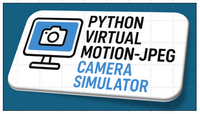 | 1. Local physical camera (embedded webcam or USB camera).<br>2. External live stream (RTSP/HTTP source).<br>3. Static or rotating image dataset (images loaded from a directory).<br>4. OS Screen Recording (full or partial screen screenshot).<br>5. Application-window capture (Windows-only; capture a running app window). |

The simulator intentionally mimics the web UI and behavior of [Axis IP cameras](https://www.axis.com/en-sg) so it can also be deployed as a believable camera honeypot or as a drop-in replacement for testing and integration. 

```python
# Author:      Yuancheng Liu
# Created:     2025/10/15 
# version:     v_0.0.5
# Copyright:   Copyright (c) 2025 LiuYuancheng
# License:     GNU General Public License V3
```

**Table of Contents** 

[TOC]

- [Python_Virtual_Motion-JPEG_Camera_Simulator](#python-virtual-motion-jpeg-camera-simulator)
    + [1. Introduction](#1-introduction)
      - [1.1 Architecture Overview](#11-architecture-overview)
    + [2. System Design](#2-system-design)
      - [2.1 Design of Virtual Camera Client Library](#21-design-of-virtual-camera-client-library)
      - [2.2 Design of Flask Camera Server](#22-design-of-flask-camera-server)
      - [2.3 Design of Multi-Camera View Monitor Dashboard](#23-design-of-multi-camera-view-monitor-dashboard)
    + [3. System Configuration and Usage](#3-system-configuration-and-usage)
    + [4. Program Typical Use Cases](#4-program-typical-use-cases)
      - [4.1 Usage Case as Cyber Range Surveillance System](#41-usage-case-as-cyber-range-surveillance-system)
      - [4.2 Usage Case as Cyber Exercise Main Projection Screen](#42-usage-case-as-cyber-exercise-main-projection-screen)

------

### 1. Introduction

The IoT/IP cameras are one of the critical sensors in modern IT/OT systems— used for surveillance, safety monitoring, and operational visibility. In digital-twin and simulation environments (where MU, PLCs, RTUs and even physical-world entities like trains or runway lights are modeled in software), realistic camera endpoints are often missing. The **Python Virtual Motion-JPEG Camera Simulator** is designed for filling that gap by producing believable MJPEG camera streams that can be integrated into the digital twins, cyber ranges, monitoring dashboards, and deception/honeypot deployments.

This project provides a lightweight, portable simulator that can run in VMs or containers and expose MJPEG streams over HTTP(s) with an Axis-style web UI. The system workflow diagram is shown below:


`Figure-01: System Workflow Diagram, version v_0.0.3 (2025)`

The video streams can be generated by live devices, prerecorded datasets, or on-host captures so the simulator can present contextually appropriate video — for example, showing a landing aircraft on a simulated runway camera when the digital twin indicates a plane is on final approach. 

#### 1.1 Architecture Overview

The system contents three main components as shown in the below architecture diagram:

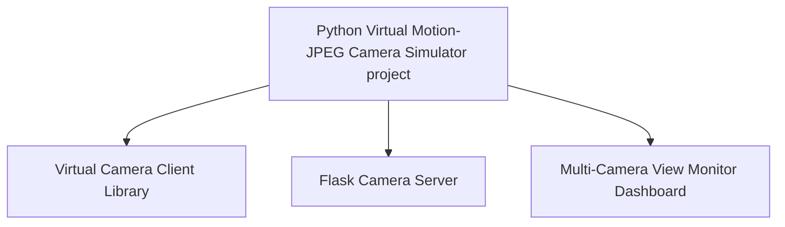

`Figure-02: System Architecture Diagram, version v_0.0.3 (2025)`

- **Virtual Camera Client Library** : Converts a variety of video/image sources into a Motion-JPEG (MJPEG) stream with configurable FPS and resolution. Supported sources: local webcams/USB cameras, RTSP/HTTP streams, image datasets, desktop screenshots (full/partial), and application-window captures (Windows only).
- **Flask Camera Server** : A management web application that mimics Axis-style camera pages. It exposes camera configuration, stream endpoints, user controls, and logs — making the simulator usable both as a realistic test camera and as a convincing honeypot UI.
- **Multi-Camera View Monitor Dashboard** : A dashboard program aggregates multiple virtual camera feeds into a single multi-frame view for monitoring or projection on command-center.

------

### 2. System Design

This section introduces the detailed design and internal structure of the three major components of the system introduced in the `Introduction[Architecture Overview]` section.

#### 2.1 Design of Virtual Camera Client Library

The `Virtual Camera Client Library` is responsible for transforming various video sources into continuous MJPEG streams that can be served to browsers or other applications. The core of this module is the base class `camClient`, which defines the streaming pipeline consisting of five main steps:

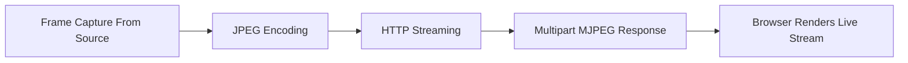

`Figure-03: Streaming Pipeline Diagram, version v_0.0.3 (2025)`

**Step 1: Frame Capture from Source**

- Each subclass implements the `camClient` interface function `getOneFrame()` to retrieve one OpenCV (`cv2`) image frames from its assigned video source. This function ensures consistent frame objects across all source types.

**Step 2: Image JPEG Encoding**

- Each captured frame is compressed into JPEG format to reduce bandwidth and enable efficient streaming :


```python
_, buffer = cv2.imencode('.jpg', frame)
```

**Step 3: Return HTTP Streaming**

- The Flask generator continuously yields each encoded JPEG frame to the HTTP response stream :

```python
yield (b'--frame\r\n'
       b'Content-Type: image/jpeg\r\n\r\n' + buffer.tobytes() + b'\r\n')
```

**Step 4: Multipart MJPEG Response**

- The HTTP response is sent using the MIME type `multipart/x-mixed-replace`, allowing browsers to interpret it as a continuous stream of JPEG images :


```javascript
mimetype='multipart/x-mixed-replace; boundary=frame'
```

**Step 5: Browser Renders Live Stream**

- In the browser’s `` element, encodes each incoming JPEG frame in order and displays them — visually creating a video :


```html

```

**2.1.1 Class Structure and Source Inheritance**

The `camClient` base class is extended by several specialized subclasses that handle different input sources:

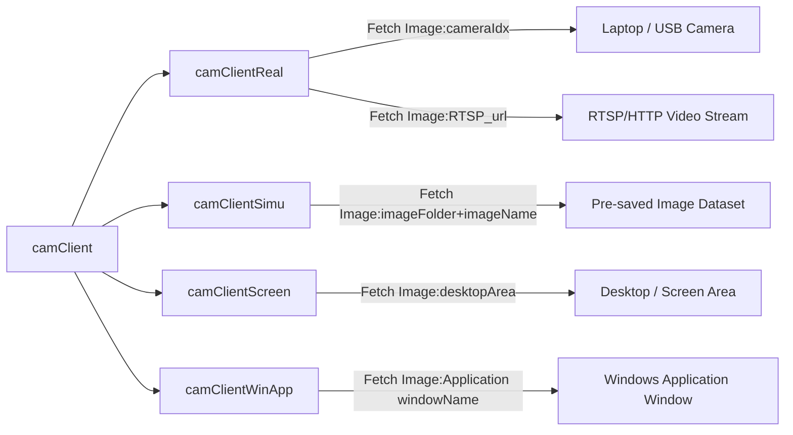

`Figure-04: Class Structure Diagram, version v_0.0.3 (2025)`

Each subclass manages its own capture logic while maintaining a unified streaming interface for the Flask server and dashboards.

#### 2.2 Design of Flask Camera Server

The `Flask Camera Server` is a web host providing user interfaces, video live view, configuration options, and API endpoints for video streaming. It also supports secure access control and linkage with physical-world simulation data in cyber range or digital twin environments. The Flask server’s operational flow / structure is shown below:

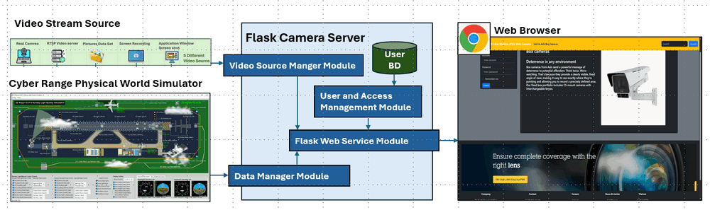

`Figure-04: Flask Server Workflow Diagram, version v_0.0.3 (2025)`

The four modules function detail includes:

- **Video Source Manager Module** : The wrapper module imports and Integrates with the `Virtual Camera Client Library` to manage frame capture from multiple video sources.
- **User and Access Management Module** : Handles authentication and authorization, linked to a credential database to manage user logins and MJPEG fetching API access permissions.
- **Data Manager Module** : The data manager module interfaces with the cyber range’s physical-world simulator to map operational states (e.g., aircraft position, train movement) to appropriate camera video display feed frames.
- **Flash Web Service Module** : The main web service module open a configurable port to handle all the http/https requests.

The Flask-based web server provides four main pages for users as shown below : 

**2.2.1 Camera Home Page**

The default landing page when the user access the camera simulator IP address, prompting user login with valid credentials before accessing the camera system : 

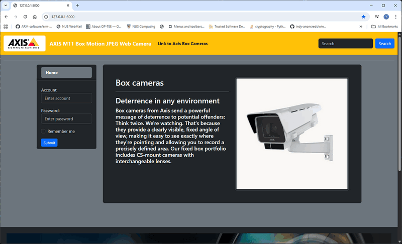

`Figure-05: IP Camera Home Page Screenshot, version v_0.0.3 (2025)`

**2.2.2 Camera Video Live View Page**

After the user login with the correct credentials, they can access the pages displays the current live MJPEG stream. Users can adjust frame resolution and FPS in real time from the page:

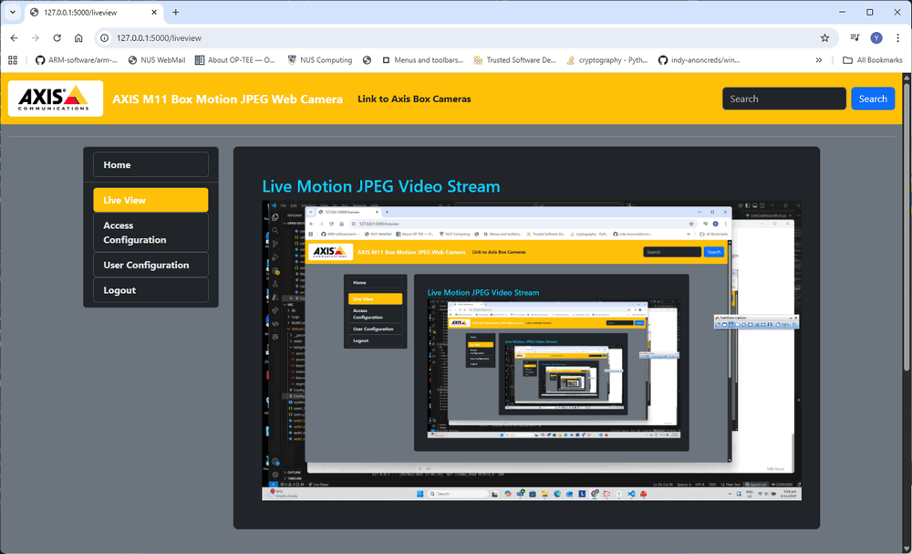

`Figure-06: Camera Video Live View Page Screenshot, version v_0.0.3 (2025)`

**2.2.3 User Configuration Page** 

Allows different types of user to manage and change the access credential. The current version provides 2 type of users: 

- **Normal users** can only view the live stream and change their own password.
- **Admin users** can add/delete users, reset / check passwords, and manage MJPEG API tokens.

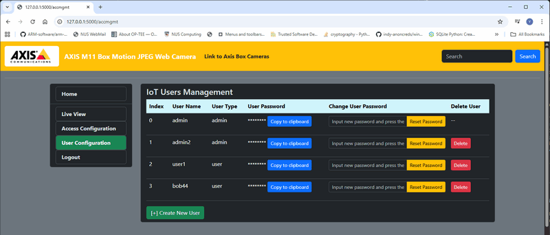

`Figure-07: User Configuration Page Screenshot, version v_0.0.3 (2025)`

**2.2.4 Access Token Configuration Page**

Used for generating and managing MJPEG API access tokens for external applications. For other program which use the motion-JPEG API to fetch the frame,  a valid access token is required when calling the API url. Only the admin user can access the API token configuration page as shown below:

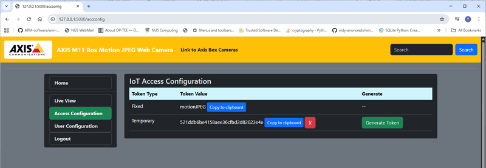

`Figure-08: Access Token Configuration Page Screenshot, version v_0.0.3 (2025)`

There are 2 types of API access tokens: 

- **Fixed Token** : The fixed token is pre-configured in the camera local data base and there is no usage limitation. The Fixed token will not lose if we reboot the camera simulator program. 
- **Temporary Token** : The temporary tokens are saved in the camera's memory, every time when the admin press the button "Generate a random token", the camera simulator will generate a 16 characters temporary token. The admin can also set the valid period of the temporary token. All the temporary tokens will be lose when the camera simulator is rebooted. 

The user access rule and available function are shown in the below table: 

| Function\User                                       | Admin User | Normal User |
| --------------------------------------------------- | ---------- | ----------- |
| Access the user management page                     | ✅          | ❌           |
| Change own password                                 | ✅          | ✅           |
| Change and check other user's password              | ✅          | ❌           |
| Add and remove normal user                          | ✅          | ❌           |
| Create new admin user                               | ✅          | ❌           |
| Remove exist admin user                             | ❌          | ❌           |
| Access the motion-JPEG token management page        | ✅          | ❌           |
| View the fixed and temporary API token              | ✅          | ❌           |
| Generate, modify and delete the temporary API token | ✅          | ❌           |

#### 2.3 Design of Multi-Camera View Monitor Dashboard

The `Multi-Camera View Monitor Dashboard` aggregates multiple virtual camera streams into one unified monitoring interface. It fetches MJPEG video feeds through HTTP API calls and displays them in a configurable multi-view layout. The network topology and configuration of the camera simulators and the dashboard is shown below:

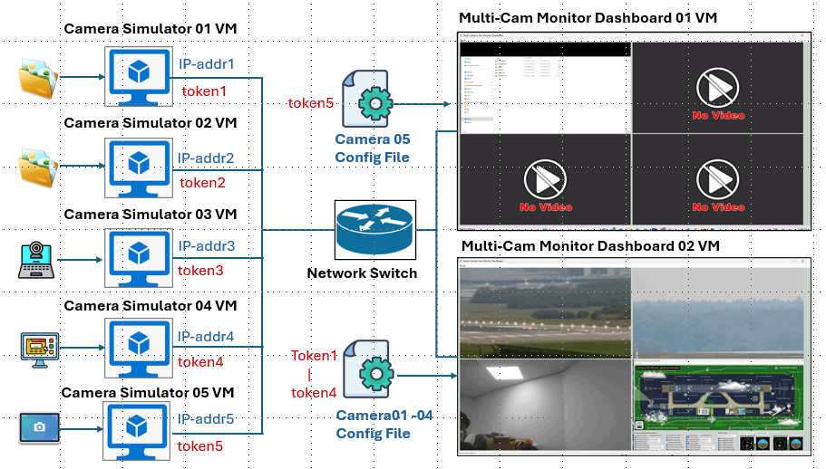

`Figure-09: Monitor Dashboard Network Diagram, version v_0.0.3 (2025)`

The display dashboard feature includes:

- Supports simultaneous monitoring of multiple MJPEG feeds.
- Configurable grid layout (e.g., 2x2, 3x3) for custom display setups.
- Adjustable stream FPS and resolution for performance tuning.
- Allows multiple dashboards to subscribe to the same camera stream

**Dashboard's Camera Access Configuration File**

Each camera feed is defined in a JSON configuration file. Below is an example to add a new camera into the dashboard: 

```json
    "Desktop1": {
        "name": "Desktop screenshot 1 virtual Camera",
        "url": "http://127.0.0.1:5000/cgi-bin/mjpg/",
        "token": "motionJPEG",
        "size": [
            640,
            480
        ]
    },    
```

The dashboard supports flexible layout configuration, adjustable FPS, and can display multiple camera streams in a single window or across multiple displays.


------

### 3. System Configuration and Usage

**For system usage and configuration, please refer to the [System Usage Manual Document](UsageManual.md)**

**3.1.1 Development Environment** : Python 3.7.4+

**3.1.2 Project file list and module function description**

Virtual Camera Client Library

| Program File                               | Execution Env   | Description                         |
| ------------------------------------------ | --------------- | ----------------------------------- |
| `src/lib/virtualCamera.py`                 | python 3        | Virtual camera lib module           |
| `src/lib/virtualCameraTest.py + templates` | python 3 + HTML | Virtual camera lib test case module |

Flask Camera Server

| Program File                         | Execution Env | Description                                                  |
| ------------------------------------ | ------------- | ------------------------------------------------------------ |
| `src/VirtualCam/static/*`            | CSS, JS,Image | All the web CSS, JavaScript and image                        |
| `src/VirtualCam/templates/*`         | HTML          | All the html pages of the web.                               |
| `src/VirtualCam/Config_templat.txt`  |               | The configuration template file for user to build own config file. |
| `src/VirtualCam/users_template.json` | JSON          | The user credential data base file template.                 |
| `src/VirtualCam/webCamGlobal.py`     | python 3      | Global parameter module.                                     |
| `src/VirtualCam/webCamDataMgr.py`    | python 3      | Optional module to linked to the cyber range physical world simulation module. |
| `src/VirtualCam/webCamAuth.py`       | python 3      | Flask user authorization module.                             |
| `src/VirtualCam/webCamApp.py`        | python 3      | Main Flask web host execution module.                        |

Multi-Camera View Monitor Dashboard

| Program File                                                | Execution Env | Description                                             |
| ----------------------------------------------------------- | ------------- | ------------------------------------------------------- |
| `src/MultiCamViewDashboard/camDashboardConfig_template.txt` |               | Dashboard configuration template file.                  |
| `src/MultiCamViewDashboard/camDashboardDataMgr.py`          | python 3      | Sub-thread module to fetch MJPEG image from all cameras |
| `src/MultiCamViewDashboard/camDashboardGlobal.py`           | python 3      | Global parameter module.                                |
| `src/MultiCamViewDashboard/camDashboardPanel.py`            | python 3      | Dashboard display panel module.                         |
| `src/MultiCamViewDashboard/cameraConfig_template.json`      | JSON          | Camera access configuration file template.              |
| `src/MultiCamViewDashboard/camDashboardRun.py`              | python 3      | Dashboard main execution module.                        |


------

### 4. Program Typical Use Cases

The system is design for using in build the OT cyber ranges and supporting the cyber exercise, the possible use cases include:  

- Provide instrumented camera endpoints for blue/red team exercises and cyber ranges.
- Deploy believable camera honeypots to capture attacker behavior and build datasets.
- Integrate camera feeds into digital-twin scenarios (e.g., show state-dependent video based on simulated operations).
- Test and validate surveillance clients, analytics pipelines, and dashboards without physical cameras.
- Aggregate diverse video sources from virtual machines and host applications for demonstrations, QA, or ML dataset generation.

We will also show two use cases of how this project is used to simulate 4 different cameras in the aviation runway cyber range and monitor the railway cyber range HMI(s) in cyber exercise.

#### 4.1 Usage Case as Cyber Range Surveillance System

The system is used in the [Aviation runway light management system  cyber range](https://www.linkedin.com/pulse/aviation-runway-lights-management-simulation-system-yuancheng-liu-5rzhc) to simulate a tower operator's surveillance camera monitoring system to display four cameras shown below. The four cameras include : 

1. Airport runway landing area surveillance camera 
2. Airport runway takeoff area surveillance camera 
3. Tower operational room surveillance camera 
4. Cyber range physical world simulator view display camera

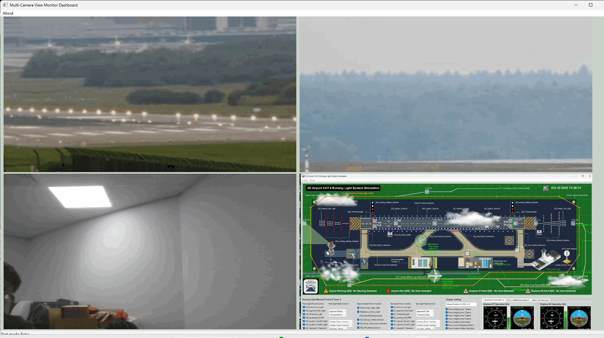

`Figure-10: Cyber Range Surveillance System Dashboard, version v_0.0.3 (2025)`

#### 4.2 Usage Case as Cyber Exercise Main Projection Screen 

The system is used in to monitor all the UI program running on different VMs of the Land Based Railway IT-OT System Cyber Security Cyber Range System in the cyber exercise and project on the big TV as shown below. The 4 monitored program includes:

1. Railway cyber range physical world simulator
2. HQ railway track signaling system monitor HMI
3. HQ railway trains monitor and control system HMI
4. HQ railway management HMI

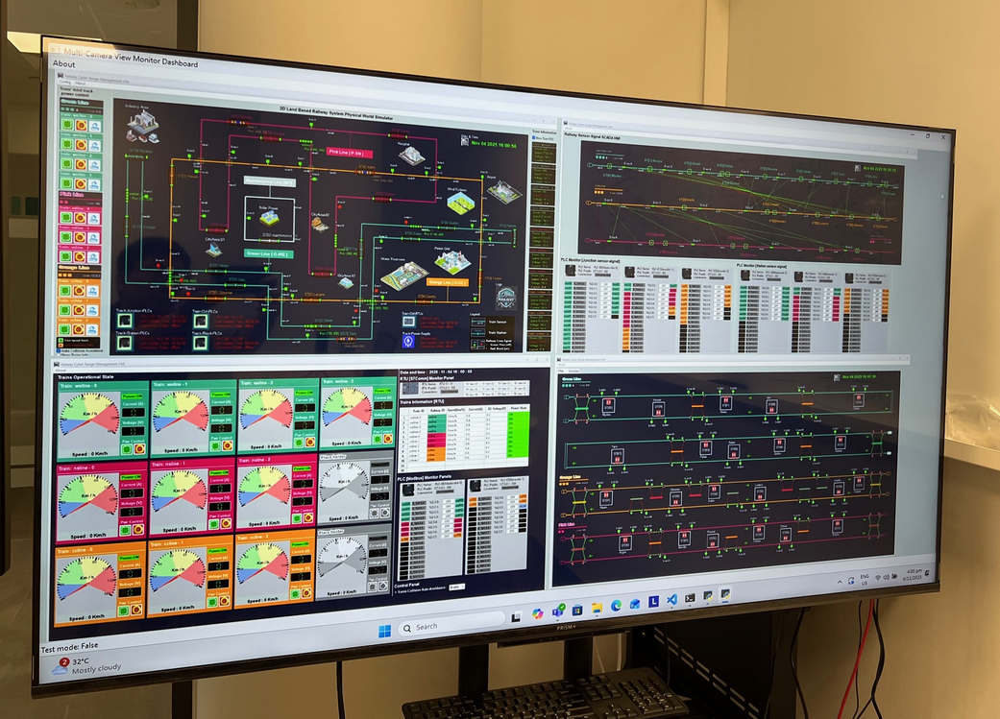

`Figure-11: Cyber Exercise Main Projection Screen, version v_0.0.3 (2025)`


------

> Last edit by LiuYuancheng (liu_yuan_cheng@hotmail.com) at 03/11/2025, if you have any problem please free to message me.