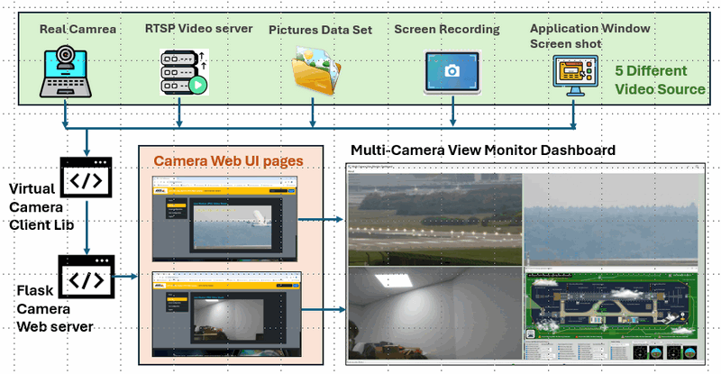
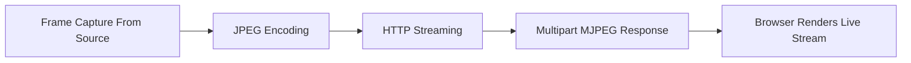
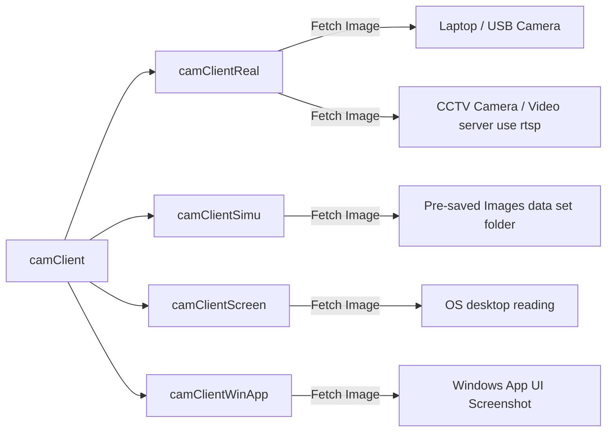

# Python_Virtual_Motion-JPEG_Camera_Simulator

**Project Design Purpose** : This project is designed to create a lightweight, extensible camera-simulation service program that exposes a Motion-JPEG (MJPEG) video stream over HTTP via a Flask web interface for the cyber ranges, red/blue exercises, and research where realistic camera endpoints are required without physical hardware. The simulated video stream can be generated from five different type of source:

- Local physical camera (embedded webcam or USB camera).

- External live stream (RTSP/HTTP source).

- Static or rotating image dataset (images loaded from a directory).

- OS Screen Recording (full or partial screen screenshot).

- Application-window capture (Windows-only; capture a running app window).

The simulator intentionally mimics the web UI and behavior of [Axis IP cameras](https://www.axis.com/en-sg) so it can be deployed as a believable camera honeypot or as a drop-in replacement for testing and integration. 

```python
# Author:      Yuancheng Liu
# Created:     2025/10/15 
# version:     v_0.0.3
# Copyright:   Copyright (c) 2025 LiuYuancheng
# License:     GNU General Public License V3
```

**Table of Contents** 

[TOC]

------

### Introduction

The IoT/IP cameras are critical sensors in modern IT/OT environments — used for surveillance, safety monitoring, and operational visibility. In digital-twin and simulation environments (where MU, PLCs, RTUs and even physical-world entities like trains or runway lights are modeled in software), realistic camera endpoints are often missing. The **Python Virtual Motion-JPEG Camera Simulator** fills that gap by producing believable MJPEG camera streams that can be integrated into digital twins, cyber ranges, monitoring dashboards, and deception/honeypot deployments.

This project provides a lightweight, portable simulator that can run in VMs or containers and expose MJPEG streams over HTTP with an Axis-style web UI. The video streams can be generated by live devices, prerecorded datasets, or on-host captures so the simulator can present contextually appropriate video — for example, showing a landing aircraft on a simulated runway camera when the digital twin indicates a plane is on final approach.

#### Architecture Overview

The system contents three main components as shown in the below architecture diagram:



- **Virtual Camera Client Library** : Converts a variety of video/image sources into a Motion-JPEG (MJPEG) stream with configurable FPS and resolution. Supported sources: local webcams/USB cameras, RTSP/HTTP streams, image datasets, desktop screenshots (full/partial), and application-window captures (Windows only).
- **Flask Camera Server** : A management web application that mimics Axis-style camera pages. It exposes camera configuration, stream endpoints, user controls, and logs — making the simulator usable both as a realistic test camera and as a convincing honeypot UI.
- **Multi-Camera View Monitor Dashboard** : A dashboard program aggregates multiple virtual camera feeds into a single multi-frame view for monitoring or projection on command-center.

#### Program Typical Use Cases

The system is design for using in build the OT cyber ranges and supporting the cyber exercise, the possible use cases include:  

- Provide instrumented camera endpoints for blue/red team exercises and cyber ranges.
- Deploy believable camera honeypots to capture attacker behaviour and build datasets.
- Integrate camera feeds into digital-twin scenarios (e.g., show state-dependent video based on simulated operations).
- Test and validate surveillance clients, analytics pipelines, and dashboards without physical cameras.
- Aggregate diverse video sources from virtual machines and host applications for demonstrations, QA, or ML dataset generation.

We will also show a use case of how this project is used to simulate 4 different cameras in the aviation runway cyber range.


------

### System Design 

In this section I will introduce the detailed design of the system.

#### Design of Virtual Camera Client Library

The virtual camera module provides a parent `camClient` class with a five steps to transfer the videos stream to browser as shown below:



**Frame Capture From Source**

All the children class will overwrite the interface function `getOneFrame()` to fetch the related `OpenCV-cv2` Image from the video source it connected.

**JPEG Encoding**

Each cv2 image frame is compressed with the JPEG encoding:

```python
_, buffer = cv2.imencode('.jpg', frame)
```

**HTTP Streaming**
The Flask generator `yields` each JPEG in the HTTP response:

```python
yield (b'--frame\r\n'
       b'Content-Type: image/jpeg\r\n\r\n' + buffer.tobytes() + b'\r\n')
```

**Multipart MJPEG Response**

 Tells the browser to expect *multiple JPEG frames* in one continuous HTTP response:

```http
mimetype='multipart/x-mixed-replace; boundary=frame'
```

**Browser Renders Live Stream**

In the browser’s `` element, ecodes each incoming JPEG frame in order and displays them — visually creating a video:

```

```

Each child class will inherit the `camClient` class and linked to the related video source as shown below:



#### Design of Flask Camera Server

The flask camera server provide the basic IOT camera web pages for the user to change the camera configuration, view the live view of the camera, 