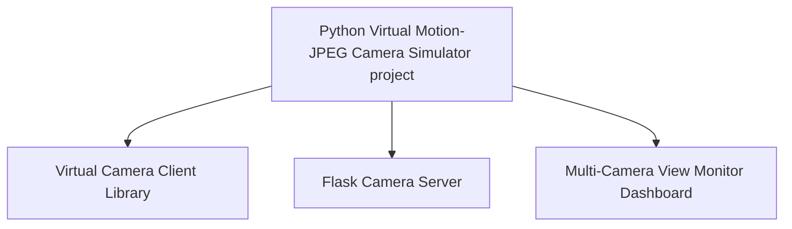
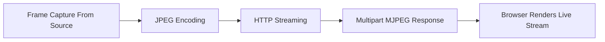

# Python_Virtual_Motion-JPEG_Camera_Simulator

[us English](README.md) | **cn 中文**

**Project Design Purpose** : 该项目旨在创建一个轻量级、可扩展的摄像头模拟服务程序，通过 Flask Web 界面，在 HTTP(s) 上公开一个 Motion-JPEG (MJPEG) 视频流，用于网络靶场、红/蓝对抗演习以及研究，在这些场景中，需要逼真的摄像头端点，但又无需物理硬件。

| Project Logo                | 模拟视频流可以从五种不同类型的源生成：                       |
| --------------------------- | ------------------------------------------------------------ |
|  | 1. 本地物理摄像头（嵌入式网络摄像头或 USB 摄像头）。 <br>2. 外部实时流（RTSP/HTTP 源）。<br>3. 静态或旋转图像数据集（从目录加载的图像）。<br>4. 操作系统屏幕录制（完整或部分屏幕截图）。<br>5. 应用程序窗口捕获（仅限 Windows；捕获正在运行的应用程序窗口）。 |

该模拟器有意模仿 [Axis IP cameras](https://www.axis.com/en-sg) 的 Web UI 和行为，因此它也可以部署为可信的摄像头蜜罐，或作为测试和集成的直接替代品。

```python
# Author:      Yuancheng Liu
# Created:     2025/10/15 
# version:     v_0.0.5
# Copyright:   Copyright (c) 2025 LiuYuancheng
# License:     GNU General Public License V3
```

**Table of Contents** 

[TOC]

------

### 1. 項目簡介

IoT/IP 摄像头是现代 IT/OT 系统中的关键传感器之一，用于监视、安全监控和操作可见性。在数字孪生和模拟环境（其中 MU、PLC、RTU 甚至像火车或跑道灯这样的物理世界实体都在软件中建模）中，通常缺少逼真的摄像头端点。**Python Virtual Motion-JPEG Camera Simulator** 旨在通过生成可信的 MJPEG 摄像头流来填补这一空白，这些流可以集成到数字孪生、网络靶场、监控仪表板以及欺骗/蜜罐部署中。

该项目提供了一个轻量级、便携式的模拟器，可以在 VM 或容器中运行，并通过 HTTP(s) 公开带有 Axis 风格 Web UI 的 MJPEG 流。系统工作流程图如下所示：


```
Figure-01: System Workflow Diagram, version v_0.0.3 (2025)
```

视频流可以由实时设备、预先录制的数据集或主机上的捕获生成，因此模拟器可以呈现上下文相关的视频——例如，当数字孪生指示飞机正在最后进近时，在模拟跑道摄像头上显示着陆的飞机。

#### 1.1 架構概觀

该系统包含三个主要组件，如下面的架构图所示：



- **Virtual Camera Client Library** : 将各种视频/图像源转换为具有可配置 FPS 和分辨率的 Motion-JPEG (MJPEG) 流。支持的源：本地网络摄像头/USB 摄像头、RTSP/HTTP 流、图像数据集、桌面屏幕截图（完整/部分）和应用程序窗口捕获（仅限 Windows）。
- **Flask Camera Server** : 一个模仿 Axis 风格摄像头页面的管理 Web 应用程序。它公开摄像头配置、流端点、用户控件和日志——使模拟器既可以用作逼真的测试摄像头，也可以用作令人信服的蜜罐 UI。
- **Multi-Camera View Monitor Dashboard** : 一个仪表板程序，将多个虚拟摄像头源聚合到一个多帧视图中，用于在指挥中心进行监控或投影。

------

### 2. 系統設計

本節介紹系統三個主要元件的詳細設計和內部結構，這些元件在 `Introduction[Architecture Overview]` 節中介紹。

#### 2.1 Virtual Camera Client Library 的設計

`Virtual Camera Client Library` 負責將各種視訊來源轉換為可以提供給瀏覽器或其他應用程式的連續 MJPEG 串流。此模組的核心是基底類別 `camClient`，它定義了由五個主要步驟組成的串流管道：



**步驟 1：從來源擷取畫面**

- 每個子類別都實現 `camClient` 介面函數 `getOneFrame()`，以從其指定的視訊來源檢索一個 OpenCV (`cv2`) 影像畫面。此函數確保所有來源類型都具有一致的畫面物件。

**步驟 2：影像 JPEG 編碼**

- 每個擷取的畫面都被壓縮成 JPEG 格式，以減少頻寬並實現高效串流：

```python
_, buffer = cv2.imencode('.jpg', frame)
```

**步驟 3：傳回 HTTP 串流**

- Flask 產生器持續產生每個編碼的 JPEG 畫面到 HTTP 回應串流：

```python
yield (b'--frame\r\n'
       b'Content-Type: image/jpeg\r\n\r\n' + buffer.tobytes() + b'\r\n')
```

**步驟 4：Multipart MJPEG 回應**

- HTTP 回應使用 MIME 類型 `multipart/x-mixed-replace` 發送，允許瀏覽器將其解釋為連續的 JPEG 影像串流：

```javascript
mimetype='multipart/x-mixed-replace; boundary=frame'
```

**步驟 5：瀏覽器呈現直播串流**

- 在瀏覽器的 `` 元素中，依序編碼每個傳入的 JPEG 畫面並顯示它們 - 在視覺上建立視訊：

```html

```

