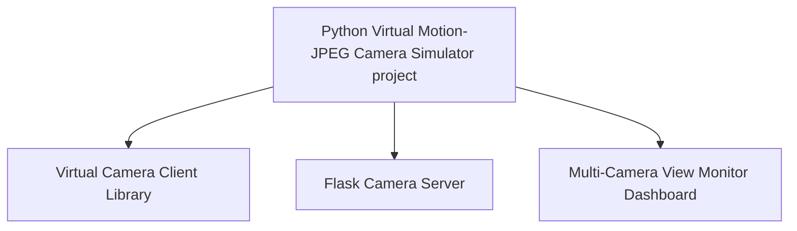
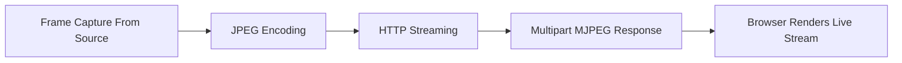
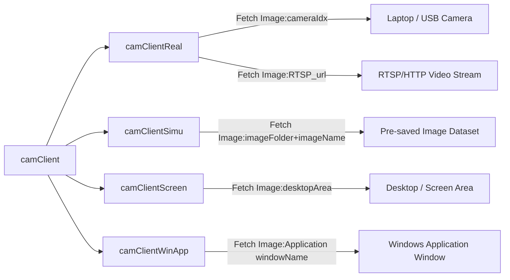

# Python_Virtual_Motion-JPEG_Camera_Simulator

[us English](README.md) | **cn 中文**

**Project Design Purpose** : 该项目旨在创建一个轻量级、可扩展的摄像头模拟服务程序，通过 Flask Web 界面，在 HTTP(s) 上公开一个 Motion-JPEG (MJPEG) 视频流，用于网络靶场、红/蓝对抗演习以及研究，在这些场景中，需要逼真的摄像头端点，但又无需物理硬件。

| Project Logo                | 模拟视频流可以从五种不同类型的源生成：                       |
| --------------------------- | ------------------------------------------------------------ |
|  | 1. 本地物理摄像头（嵌入式网络摄像头或 USB 摄像头）。 <br>2. 外部实时流（RTSP/HTTP 源）。<br>3. 静态或旋转图像数据集（从目录加载的图像）。<br>4. 操作系统屏幕录制（完整或部分屏幕截图）。<br>5. 应用程序窗口捕获（仅限 Windows；捕获正在运行的应用程序窗口）。 |

该模拟器有意模仿 [Axis IP cameras](https://www.axis.com/en-sg) 的 Web UI 和行为，因此它也可以部署为可信的摄像头蜜罐，或作为测试和集成的直接替代品。

```python
# Author:      Yuancheng Liu
# Created:     2025/10/15 
# version:     v_0.0.5
# Copyright:   Copyright (c) 2025 LiuYuancheng
# License:     GNU General Public License V3
```

**Table of Contents** 

[TOC]

------

### 1. 項目簡介

IoT/IP 摄像头是现代 IT/OT 系统中的关键传感器之一，用于监视、安全监控和操作可见性。在数字孪生和模拟环境（其中 MU、PLC、RTU 甚至像火车或跑道灯这样的物理世界实体都在软件中建模）中，通常缺少逼真的摄像头端点。**Python Virtual Motion-JPEG Camera Simulator** 旨在通过生成可信的 MJPEG 摄像头流来填补这一空白，这些流可以集成到数字孪生、网络靶场、监控仪表板以及欺骗/蜜罐部署中。

该项目提供了一个轻量级、便携式的模拟器，可以在 VM 或容器中运行，并通过 HTTP(s) 公开带有 Axis 风格 Web UI 的 MJPEG 流。系统工作流程图如下所示：


```
Figure-01: System Workflow Diagram, version v_0.0.3 (2025)
```

视频流可以由实时设备、预先录制的数据集或主机上的捕获生成，因此模拟器可以呈现上下文相关的视频——例如，当数字孪生指示飞机正在最后进近时，在模拟跑道摄像头上显示着陆的飞机。

#### 1.1 架構概觀

该系统包含三个主要组件，如下面的架构图所示：



- **Virtual Camera Client Library** : 将各种视频/图像源转换为具有可配置 FPS 和分辨率的 Motion-JPEG (MJPEG) 流。支持的源：本地网络摄像头/USB 摄像头、RTSP/HTTP 流、图像数据集、桌面屏幕截图（完整/部分）和应用程序窗口捕获（仅限 Windows）。
- **Flask Camera Server** : 一个模仿 Axis 风格摄像头页面的管理 Web 应用程序。它公开摄像头配置、流端点、用户控件和日志——使模拟器既可以用作逼真的测试摄像头，也可以用作令人信服的蜜罐 UI。
- **Multi-Camera View Monitor Dashboard** : 一个仪表板程序，将多个虚拟摄像头源聚合到一个多帧视图中，用于在指挥中心进行监控或投影。

------

### 2. 系統設計

本節介紹系統三個主要元件的詳細設計和內部結構，這些元件在 `Introduction[Architecture Overview]` 節中介紹。

#### 2.1 Virtual Camera Client Library 的設計

`Virtual Camera Client Library` 負責將各種視訊來源轉換為可以提供給瀏覽器或其他應用程式的連續 MJPEG 串流。此模組的核心是基底類別 `camClient`，它定義了由五個主要步驟組成的串流管道：



**步驟 1：從來源擷取畫面**

- 每個子類別都實現 `camClient` 介面函數 `getOneFrame()`，以從其指定的視訊來源檢索一個 OpenCV (`cv2`) 影像畫面。此函數確保所有來源類型都具有一致的畫面物件。

**步驟 2：影像 JPEG 編碼**

- 每個擷取的畫面都被壓縮成 JPEG 格式，以減少頻寬並實現高效串流：

```python
_, buffer = cv2.imencode('.jpg', frame)
```

**步驟 3：傳回 HTTP 串流**

- Flask 產生器持續產生每個編碼的 JPEG 畫面到 HTTP 回應串流：

```python
yield (b'--frame\r\n'
       b'Content-Type: image/jpeg\r\n\r\n' + buffer.tobytes() + b'\r\n')
```

**步驟 4：Multipart MJPEG 回應**

- HTTP 回應使用 MIME 類型 `multipart/x-mixed-replace` 發送，允許瀏覽器將其解釋為連續的 JPEG 影像串流：

```javascript
mimetype='multipart/x-mixed-replace; boundary=frame'
```

**步驟 5：瀏覽器呈現直播串流**

- 在瀏覽器的 `` 元素中，依序編碼每個傳入的 JPEG 畫面並顯示它們 - 在視覺上建立視訊：

```html

```

**2.1.1 類別結構和來源繼承**

`camClient` 基底類別由幾個專門的子類別擴展，這些子類別處理不同的輸入來源：



```
Figure-04: Class Structure Diagram, version v_0.0.3 (2025)
```

每個子類別管理其自己的擷取邏輯，同時為 Flask 伺服器和儀表板維護統一的串流介面

#### 2.2 Flask Camera Server 的設計

`Flask Camera Server` 是一個網頁主機，提供使用者介面、視訊直播檢視、配置選項和用於視訊串流的 API 端點。它還支援安全存取控制，並與網路靶場或數位分身環境中的實體世界模擬資料連結。Flask 伺服器的操作流程/結構如下所示：


```
Figure-04: Flask Server Workflow Diagram, version v_0.0.3 (2025)
```

四個模組的功能詳細資訊包括：

- **Video Source Manager Module**：封裝模組匯入並與 `Virtual Camera Client Library` 整合，以管理從多個視訊來源擷取畫面。
- **User and Access Management Module**：處理身份驗證和授權，連結到憑證資料庫以管理使用者登入和 MJPEG 擷取 API 存取權限。
- **Data Manager Module**：資料管理員模組與網路靶場的實體世界模擬器介接，以將操作狀態（例如，飛機位置、火車移動）對應到適當的攝影機視訊顯示饋送畫面。
- **Flash Web Service Module**：主要網頁服務模組開啟一個可配置的埠，以處理所有 http/https 請求。

基於 Flask 的網頁伺服器為使用者提供四個主要頁面，如下所示：

**2.2.1 [1] Camera Home Page**

當使用者存取攝影機模擬器 IP 位址時的預設登陸頁面，提示使用者在使用有效憑證登入後才能存取攝影機系統：


```
Figure-05: IP Camera Home Page Screenshot, version v_0.0.3 (2025)
```

**2.2.2 [2] Camera Video Live View Page**

使用者使用正確的憑證登入後，他們可以存取顯示目前直播 MJPEG 串流的頁面。使用者可以從頁面即時調整畫面解析度和 FPS：


```
Figure-06: Camera Video Live View Page Screenshot, version v_0.0.3 (2025)
```

**2.2.3 [3] User Configuration Page**

允許不同類型的使用者管理和變更存取憑證。目前版本提供 2 種類型的使用者：

- **Normal users** 只能檢視直播串流並變更自己的密碼。
- **Admin users** 可以新增/刪除使用者、重設/檢查密碼，以及管理 MJPEG API 權杖。


```
Figure-07: User Configuration Page Screenshot, version v_0.0.3 (2025)
```

**2.2.4 [4] Access Token Configuration Page**

用於為外部應用程式產生和管理 MJPEG API 存取權杖。對於其他使用 motion-JPEG API 擷取畫面的程式，在呼叫 API url 時需要有效的存取權杖。只有管理員使用者才能存取 API 權杖配置頁面，如下所示：


```
Figure-08: Access Token Configuration Page Screenshot, version v_0.0.3 (2025)
```

有 2 種類型的 API 存取權杖：

- **Fixed Token**：固定權杖已在攝影機本機資料庫中預先配置，並且沒有使用限制。如果我們重新啟動攝影機模擬器程式，固定權杖將不會遺失。
- **Temporary Token**：臨時權杖儲存在攝影機的記憶體中，每次管理員按下「產生隨機權杖」按鈕時，攝影機模擬器都會產生一個 16 個字元的臨時權杖。管理員還可以設定臨時權杖的有效期限。當攝影機模擬器重新啟動時，所有臨時權杖都將遺失。

使用者存取規則和可用功能如下表所示：

| 功能\使用者                   | 管理員使用者 | 一般使用者 |
| :---------------------------- | :----------- | :--------- |
| 存取使用者管理頁面            | ✅            | ❌          |
| 變更自己的密碼                | ✅            | ✅          |
| 變更和檢查其他使用者的密碼    | ✅            | ❌          |
| 新增和移除一般使用者          | ✅            | ❌          |
| 建立新的管理員使用者          | ✅            | ❌          |
| 移除現有的管理員使用者        | ❌            | ❌          |
| 存取 motion-JPEG 權杖管理頁面 | ✅            | ❌          |
| 檢視固定和臨時 API 權杖       | ✅            | ❌          |
| 產生、修改和刪除臨時 API 權杖 | ✅            | ❌          |

#### 2.3 Multi-Camera View Monitor Dashboard 的設計

`Multi-Camera View Monitor Dashboard` 將多個虛擬攝影機串流聚合到一個統一的監控介面中。它透過 HTTP API 呼叫擷取 MJPEG 視訊饋送，並將它們顯示在可配置的多畫面佈局中。攝影機模擬器和儀表板的網路拓撲和配置如下所示：


```
Figure-09: Monitor Dashboard Network Diagram, version v_0.0.3 (2025)
```

顯示儀表板功能包括：

- 支援同時監控多個 MJPEG 饋送。
- 可配置的網格佈局（例如，2x2、3x3）用於自訂顯示設定。
- 可調整的串流 FPS 和解析度，用於效能調整。
- 允許多個儀表板訂閱相同的攝影機串流

**儀表板的攝影機存取配置檔案**

每個攝影機饋送都在 JSON 配置檔案中定義。以下是將新攝影機新增到儀表板的範例：

```json
    "Desktop1": {
        "name": "Desktop screenshot 1 virtual Camera",
        "url": "http://127.0.0.1:5000/cgi-bin/mjpg/",
        "token": "motionJPEG",
        "size": [
            640,
            480
        ]
    },   
```

儀表板支援彈性的佈局配置、可調整的 FPS，並且可以在單個視窗或多個顯示器上顯示多個攝影機串流。


------

### 3. 系統配置和使用

**3.1.1 開發環境**：Python 3.7.4+

**3.1.2 專案檔案清單和模組功能說明**

Virtual Camera Client Library

| 程式檔案                                   | 執行環境        | 說明                        |
| :----------------------------------------- | :-------------- | :-------------------------- |
| `src/lib/virtualCamera.py`                 | python 3        | 虛擬攝影機 lib 模組         |
| `src/lib/virtualCameraTest.py + templates` | python 3 + HTML | 虛擬攝影機 lib 測試案例模組 |

Flask Camera Server

| 程式檔案                             | 執行環境      | 說明                                           |
| :----------------------------------- | :------------ | :--------------------------------------------- |
| `src/VirtualCam/static/*`            | CSS, JS,Image | 所有網頁 CSS、JavaScript 和影像                |
| `src/VirtualCam/templates/*`         | HTML          | 網頁的所有 html 頁面。                         |
| `src/VirtualCam/Config_templat.txt`  |               | 使用者建立自己的配置檔案的配置範本檔案。       |
| `src/VirtualCam/users_template.json` | JSON          | 使用者憑證資料庫檔案範本。                     |
| `src/VirtualCam/webCamGlobal.py`     | python 3      | 全域參數模組。                                 |
| `src/VirtualCam/webCamDataMgr.py`    | python 3      | 可選模組，用於連結到網路靶場實體世界模擬模組。 |
| `src/VirtualCam/webCamAuth.py`       | python 3      | Flask 使用者授權模組。                         |
| `src/VirtualCam/webCamApp.py`        | python 3      | 主要 Flask 網頁主機執行模組。                  |

Multi-Camera View Monitor Dashboard

| 程式檔案                                                    | 執行環境 | 說明                                      |
| :---------------------------------------------------------- | :------- | :---------------------------------------- |
| `src/MultiCamViewDashboard/camDashboardConfig_template.txt` |          | 儀表板配置範本檔案。                      |
| `src/MultiCamViewDashboard/camDashboardDataMgr.py`          | python 3 | 從所有攝影機擷取 MJPEG 影像的子執行緒模組 |
| `src/MultiCamViewDashboard/camDashboardGlobal.py`           | python 3 | 全域參數模組。                            |
| `src/MultiCamViewDashboard/camDashboardPanel.py`            | python 3 | 儀表板顯示面板模組。                      |
| `src/MultiCamViewDashboard/cameraConfig_template.json`      | JSON     | 攝影機存取配置檔案範本。                  |
| `src/MultiCamViewDashboard/camDashboardRun.py`              | python 3 | 儀表板主要執行模組。                      |

#### 3.2 系統預先設定

在配置系統之前，請安裝下表中其他 lib/軟體：

| Lib 模組      | 版本     | 安裝                        | Lib 連結                                     |
| :------------ | :------- | :-------------------------- | :------------------------------------------- |
| Flask         | 1.1.2    | `pip install Flask`         | https://flask.palletsprojects.com/en/stable/ |
| Flask_Login   | 0.6.2    | `pip install Flask-Login`   | https://pypi.org/project/Flask-Login/        |
| numpy         | 1.21.6   | `pip install numpy`         | https://pypi.org/project/numpy/              |
| opencv_python | 4.5.1.48 | `pip install opencv-python` | https://pypi.org/project/opencv-python/      |
| PyAutoGUI     | 0.9.53   | `pip install PyAutoGUI`     | https://pyautogui.readthedocs.io/en/latest/  |
| pywin32       | 305      | `pip install pywin32`       | https://pypi.org/project/pywin32/            |
| requests      | 2.28.1   | `pip install requests`      | https://pypi.org/project/requests/           |
| win32gui      | 221.6    | `pip install win32gui`      | https://pypi.org/project/win32gui/           |
| wxPython      | 4.1.0    | `pip install wxPython`      | https://pypi.org/project/wxPython/           |


------

### 4. 程序典型用例

該系統設計用於構建 OT cyber range 並支援 cyber exercise，可能嘅 use case 包括：

- 為 blue/red team exercise 和 cyber range 提供 instrumented camera endpoint。
- 部署 believable camera honeypot 以捕獲 attacker 行為並構建 dataset。
- 將 camera feed 整合到 digital-twin scenario 中（例如，顯示基於 simulated operation 嘅 state-dependent video）。
- 在沒有 physical camera 嘅情況下測試和驗證 surveillance client、analytics pipeline 和 dashboard。
- 從 virtual machine 和 host application 聚合各種 video source，以進行 demonstration、QA 或 ML dataset generation。

我們還將展示兩個 use case，說明如何使用此 project 在 aviation runway cyber range 中模擬 4 個不同嘅 camera，並在 cyber exercise 中監控 railway cyber range HMI。

#### 4.1 用例：作为网络靶场监控系统

該系統用於 [Aviation runway light management system cyber range](https://www.linkedin.com/pulse/aviation-runway-lights-management-simulation-system-yuancheng-liu-5rzhc) 中，以模擬 tower operator 嘅 surveillance camera 監控系統，以顯示如下所示嘅四個 camera。這四個 camera 包括：

1. 机场跑道着陆区监控摄像头
2. 机场跑道起飞区监控摄像头
3. 塔台操作室监控摄像头
4. 网络靶场物理世界模拟器视图显示摄像头


```
Figure-10: Cyber Range Surveillance System Dashboard, version v_0.0.3 (2025)
```

#### 4.2 用例：作为网络演习主投影屏幕

該系統用於監控在 Land Based Railway IT-OT System Cyber Security Cyber Range System 嘅不同 VM 上運行嘅所有 UI program，並在 cyber exercise 中投影到大電視上，如下所示。4 個受監控嘅 program 包括：

1. 铁路网络靶场物理世界模拟器
2. 总部铁路轨道信号系统监控 HMI
3. 总部铁路列车监控和控制系统 HMI
4. 总部铁路管理 HMI


```
Figure-11: Cyber Exercise Main Projection Screen, version v_0.0.3 (2025)
```


------

> Last edit by LiuYuancheng (liu_yuan_cheng@hotmail.com) at 03/11/2025, if you have any problem please free to message me.