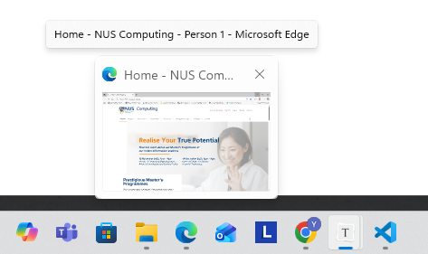
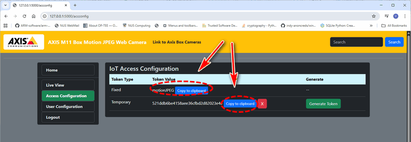
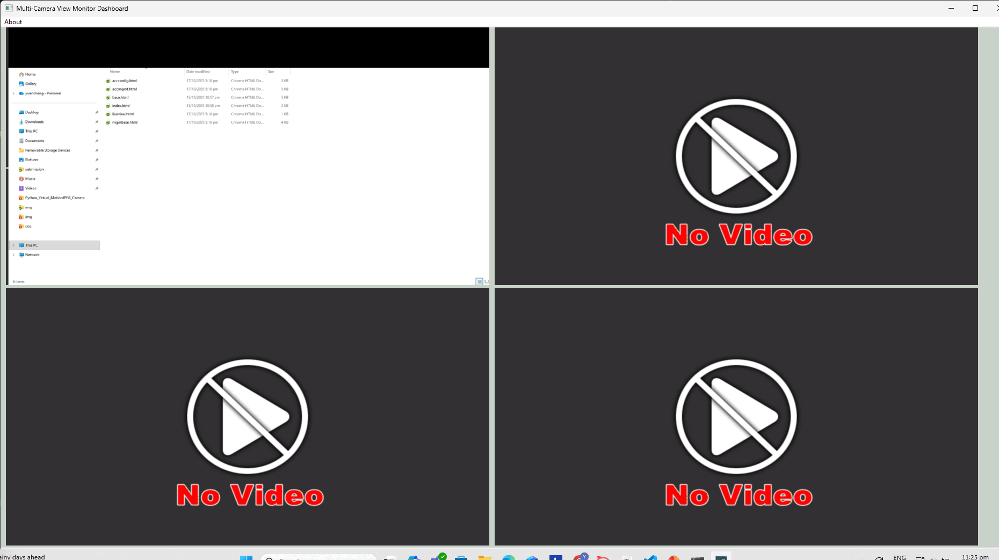

# Python_Virtual_Motion-JPEG_Camera_Simulator [Usage Manual]

This document will show the detailed setup, configuration and usage of the Python_Virtual_Motion-JPEG_Camera_Simulator system. 


```python
# Author:      Yuancheng Liu
# Created:     2025/10/15 
# version:     v_0.0.5
# Copyright:   Copyright (c) 2025 LiuYuancheng
# License:     GNU General Public License V3
```

**Table of Contents**

[TOC]

- [Python_Virtual_Motion-JPEG_Camera_Simulator [Usage Manual]](#python-virtual-motion-jpeg-camera-simulator--usage-manual-)
    + [System Setup](#system-setup)
    + [Usage of Virtual Camera](#usage-of-virtual-camera)
      - [Step 1: Setup the web configuration file.](#step-1--setup-the-web-configuration-file)
      - [Step 2: Setup the video source](#step-2--setup-the-video-source)
      - [Step 3: Setup the user authorization file](#step-3--setup-the-user-authorization-file)
      - [Step4: Run the virtual camera program](#step4--run-the-virtual-camera-program)
    + [Usage of Camera View Dashboard](#usage-of-camera-view-dashboard)
      - [Step 1: Setup the dashboard configuration file.](#step-1--setup-the-dashboard-configuration-file)
      - [Step2: Setup the cameras connection configuration file](#step2--setup-the-cameras-connection-configuration-file)
      - [Step3: Run the dashboard](#step3--run-the-dashboard)
    + [Problem and Solution](#problem-and-solution)

------

### System Pre-Setup

Before configure the system, install the additional lib/software in the below table:

| Lib Module    | Version  | Installation                | Lib link                                     |
| ------------- | -------- | --------------------------- | -------------------------------------------- |
| Flask         | 1.1.2    | `pip install Flask`         | https://flask.palletsprojects.com/en/stable/ |
| Flask_Login   | 0.6.2    | `pip install Flask-Login`   | https://pypi.org/project/Flask-Login/        |
| numpy         | 1.21.6   | `pip install numpy`         | https://pypi.org/project/numpy/              |
| opencv_python | 4.5.1.48 | `pip install opencv-python` | https://pypi.org/project/opencv-python/      |
| PyAutoGUI     | 0.9.53   | `pip install PyAutoGUI`     | https://pyautogui.readthedocs.io/en/latest/  |
| pywin32       | 305      | `pip install pywin32`       | https://pypi.org/project/pywin32/            |
| requests      | 2.28.1   | `pip install requests`      | https://pypi.org/project/requests/           |
| win32gui      | 221.6    | `pip install win32gui`      | https://pypi.org/project/win32gui/           |
| wxPython      | 4.1.0    | `pip install wxPython`      | https://pypi.org/project/wxPython/           |


------

### Usage of Virtual Camera

Work Folder : `src/VirtualCam`

#### Step 1: Setup the web configuration file.

Rename the configuration file template `Config_template.txt` to `Config.txt` and set the parameter as shown below :

```python
# This is the config file template for the module <webCamApp.py>
# Setup the parameter with below format (every line follows <key>:<val> format, the
# key can not be changed):
#-----------------------------------------------------------------------------
# Camera mode flag, 
CAM_MD:2
#-----------------------------------------------------------------------------
# Camera Admin user config and user record file. 
USERS_RCD:users.json
#-----------------------------------------------------------------------------
# Define physical world simulator IP
RW_IP:127.0.0.1
# Define physical world simulator connection port
RW_PORT:3001
RW_REFRESH_TIME:1
# Physical world reconnection time 
RW_RECONN_TIME:10
#-----------------------------------------------------------------------------
# Camera video source parameter:
# Simulated camera report to RW ID:
CAM_ID:RW_CAM_REAL
# Physical camera ID
CAM_IDX:0
CAM_FPS:6
# Simulated camera data set parameters:
CAM_DATA_DIR:takeoff
CAM_DATA_PREFIX:takeoff-
CAM_DATA_START_IDX:6
CAM_DATA_END_IDX:53
#-----------------------------------------------------------------------------
# Init the Flask app parameters
FLASK_SER_PORT:5000
FLASK_DEBUG_MD:False
FLASK_MULTI_TH:True
FLASK_FIXED_TOKEN:motionJPEG
```


#### Step 2: Setup the video source

Set the camera mode flag parameter in the configuration file:

- `CAM_MD:1` - From real camera 
- `CAM_MD:2` - From image data set
- `CAM_MD:3` - From desktop screen recording
- `CAM_MD:4` - From Windows application.

In the `webCamApp.py`, configure the video source  as shown below:

```python
if gv.gCamMode == 0:
    gv.iCamMgr = cam.camClientReal(gv.gCamSrc, fps=gv.gCamFps)
elif gv.gCamMode == 1:
    gv.iCamMgr = cam.camClientSimu(gv.gCamDir, gv.gCamFilePrefix, fps=gv.gCamFps)
    gv.iCamMgr.setShowTimestamp(True)
    gv.iCamMgr.setTestMode(56)
elif gv.gCamMode == 2:
    gv.iCamMgr = cam.camClientScreen(fps=gv.gCamFps)
else:
    windowName = "templates - File Explorer"
    #windowName = "2D Airport CAT-II Runway Light System Simulation"
    #windowName = "Microsoft Edge"
    gv.iCamMgr = cam.camClientWinApp(windowName)
```

To find the entire application window name, move mouse to the Windows tasks bar then click the small top-up window to show the window name as shown below:



When capture from the windows App, the application must **not** be minimized. 


#### Step 3: Setup the user authorization file

Rename the `users_template.json` to `users.json`  and add the user name and password as shown below:

```json
    "admin": {
        "username": "admin",
        "password": "admin",
        "usertype": "admin"
    },
```


#### Step4: Run the virtual camera program

Run the flask web host and open the URL: `http://<camera ip>:<camera port>`

```
python webCamApp.py
```

To call the motion JPEG API with the GET request, copy the fix or temporary token from the token page as shown below



Then use the http GET request for the url `http://<camera ip>:<camera port>/cgi-bin/mjpg/<Access Token>` to get on frame for the virtual camera as shown below:

```python
response = requests.get(http://<camera ip>:<camera port>/cgi-bin/mjpg/<Access Token>, timeout=1)
```


### Usage of Camera View Dashboard

#### Step 1: Setup the dashboard configuration file.

Rename the configuration file template `camDashboardConfig_template.txt` to ``camDashboardConfig.txt` and set the parameter as shown below:

```python
# This is the config file template for the module <camDashboardRun.py>
# Setup the parameter with below format (every line follows <key>:<value> format, the
# key can not be changed):
#-----------------------------------------------------------------------------
# Test mode:
# - True: run the UI with out connect to the cameras.
# - False: connect to the cameras and fetch the vide stream.
#TEST_MD:True
TEST_MD:False
#-----------------------------------------------------------------------------
# Define all the HMI UI config parameters
# define UI title name 
UI_TITLE: Multi-Camera View Monitor Dashboard
# Define update clock interval
CLK_INT:0.5
#-----------------------------------------------------------------------------
# camera connection configuration file.
CAM_CONFIG_FILE:cameraConfig.json
```


#### Step2: Setup the cameras connection configuration file

 Rename the configuration file template `cameraConfig_template.json` to `cameraConfig.txt` , copy the access token (Fixed/Temporary) from the related camera's token page and add the camera you want to access in the file as shown below:

```
    "Desktop1": {
        "name": "Desktop screenshot 1 virtual Camera",
        "url": "http://127.0.0.1:5000/cgi-bin/mjpg/",
        "token": "motionJPEG",
        "size": [
            640,
            480
        ]
    },    
```

Then change the image size parameter `[ width, height ]` 


#### Step3: Run the dashboard

Make sure all the virtual camera are running and run the dashboard with cmd: 

```
python camDashboardRun
```

Then the dashboard will shown below:



The un-configured or un-connected camera will show "no video".


### Problem and Solution

If capture the window shows below error, means the captured windows window is minimized:

```
Error on request:
Traceback (most recent call last):
  File "C:\Users\liu_y\AppData\Local\Programs\Python\Python37-32\lib\site-packages\werkzeug\serving.py", line 323, in run_wsgi
    execute(self.server.app)
  File "C:\Users\liu_y\AppData\Local\Programs\Python\Python37-32\lib\site-packages\werkzeug\serving.py", line 314, in execute
    for data in application_iter:
  File "C:\Users\liu_y\AppData\Local\Programs\Python\Python37-32\lib\site-packages\werkzeug\wsgi.py", line 506, in __next__
    return self._next()
  File "C:\Users\liu_y\AppData\Local\Programs\Python\Python37-32\lib\site-packages\werkzeug\wrappers\base_response.py", line 45, in _iter_encoded  
    for item in iterable:
  File "c:\Works\TechArticles\Python_Virtual_MotionJPEG_Camera\src\lib\virtualCamera.py", line 82, in getFrames
    frame = self.getOneFrame()
  File "c:\Works\TechArticles\Python_Virtual_MotionJPEG_Camera\src\lib\virtualCamera.py", line 236, in getOneFrame
    saveBitMap = win32ui.CreateBitmap()
win32ui.error: Internal error - existing object has type 'PyCDC', but 'PyCBitmap' was requested.
```


------

> Last edit by LiuYuancheng (liu_yuan_cheng@hotmail.com) at 04/11/2025, if you have any problem please free to message me.